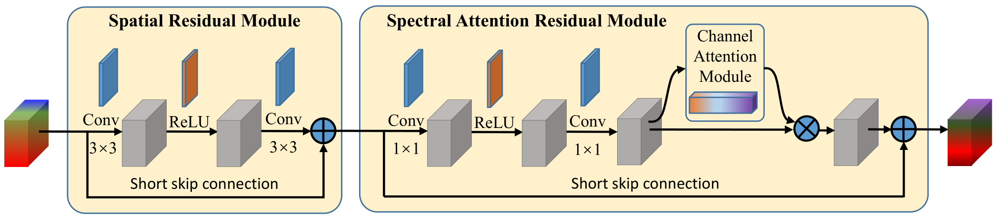
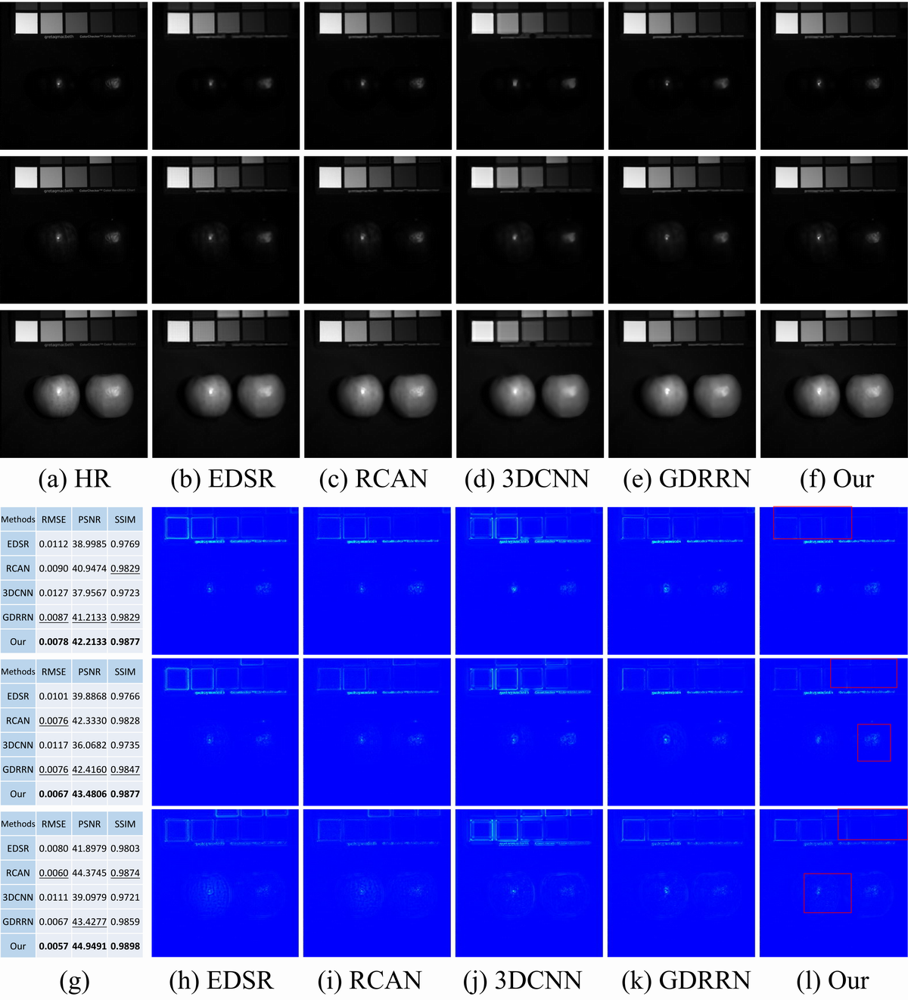

# SSPSR-Pytorch

Paper: https://ieeexplore.ieee.org/document/9097432 (IEEE Xplore) 
       https://arxiv.org/abs/2005.08752 (arXiv) 

### Learning Spatial-Spectral Prior for Super-Resolution of Hyperspectral Imagery

In this paper, we introduce a spatial-spectral prior network (SSPN) to fully exploit the spatial information and the correlation between the spectra of the hyperspectral data. Considering that the hyperspectral training samples are scarce and the spectral dimension of hyperspectral image data is very high, it is nontrivial to train a stable and effective deep network. Therefore, a group convolution (with shared network parameters) and progressive upsampling framework is proposed. This will not only alleviate the difficulty in feature extraction due to high dimension of the hyperspectral data, but also make the training process more stable. To exploit the spatial and spectral prior, we design a spatial-spectral block (SSB), which consists of a spatial residual module and a spectral attention residual module. 

# Network Architecture
- The overall network architecture of the proposed SSPSR network

   
   
- The network architecture of the spatial-spectral block (SSB)

   
   
# Results
- Chikusei Dataset
 * Average quantitative comparisons of different approaches over Chikusei dataset.

   
   
- Pavia Dataset
  * Average quantitative comparisons of different approaches over Pavia Centre dataset.

   
   
 - Cave Dataset
 * Average quantitative comparisons of different approaches over Cave dataset.

   
   
   * Reconstructed images of stuffed_toys at 480nm, 580nm and 680nm with upsampling factor d = 4.
   
   
   
   * Reconstructed images of real_and_fake_apples at 480nm, 580nm and 680nm with upsampling factor d = 8.
   
   

### If you find our work useful in your research or publication, please cite our work:
```
@article{jiang2020learning,
  title={Learning Spatial-Spectral Prior for Super-Resolution of Hyperspectral Imagery},
  author={Jiang, Junjun and Sun, He and Liu, Xianming and Ma, Jiayi},
  journal={IEEE Transactions on Computational Imaging},
  volume={},
  number={},
  pages={1-1},
  doi={10.1109/TCI.2020.2996075}
  year={2020}
}
```
